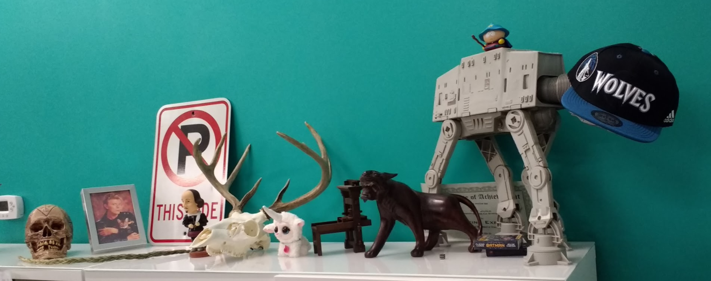

# Full Stack with Auth Group Project

Setup Directions
-----------
* Run `npm install`,
* Start mongo if not running already by using `mongod`
* Run `npm start` in an open tab of terminal

Technologies
------------
* Mongo
* Express
* Angular
* Node
* Passport
* git
* github

Project Description
-------------------
Our client, **Prime Digital Academy: Room 3**, has asked for an app to simulate the behavior of their shelf. That is, a list of items placed on the classroom shelf.

**Any visitor** to the page can view the shelf, but only logged in users should be able to place objects on the shelf. Authentication should happen on the client and the server.

This will require some research, design, an implementation. Update this README.md to include the names of the group members and your team name/number. As well as any planning/docs. These can be in digital format or even pics of whiteboard/notebook sketches.

Shelf Object
------------
Items placed on the shelf should have the following data:

* description
* placer (user)
* image url (optional)

You're going to have to think about how/where to store this data. Recall that each item will have to be associated with a user!

> NOTE: Image url should be a full path to an existing image on the web. You should not attempt to implement image upload for this.

Hard Mode
----------
* only logged in users can remove objects from the shelf
* styling

Pro Mode
--------
* logged in users can only remove their objects from the shelf
* show list of users only to logged in users
* implement [file stack](https://www.npmjs.com/package/filestack-js) for image upload

Super Mode
----------
* filter output by user (click on a user to only show items by that user)
* users can re-order shelf
